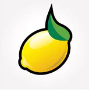

# Integrantes

+--------------------------------+---------+
| Nombre                         | Código  |
+================================+=========+
| Marbin Javier Arévalo Guerrero | 2210053 |
+--------------------------------+---------+
| Diego Alejandro Gomez          | 2211060 |
+--------------------------------+---------+

# Introducción

En el marco de este proyecto, se llevará a cabo el desarrollo de una máquina tragamonedas con el objetivo de realizar un profundo análisis del valor esperado (expected value). El enfoque central será determinar cuál de las configuraciones de la máquina resulta más conveniente para el casino. Además, se explorará el impacto de variar el número de carriles y la probabilidad asociada a cada símbolo en la frecuencia de los resultados.

El expected value se presenta como una medida crucial en la evaluación del rendimiento de la máquina, ya que representa la ganancia o pérdida esperada para el jugador en cada jugada. Un resultado negativo indicaría una pérdida para el jugador, reflejando, en cambio, una ganancia esperada para el casino.

A lo largo de este proyecto, se realizarán ajustes en las variables clave, como el número de carriles y las probabilidades de ocurrencia de los símbolos, con el fin de observar cómo estas variaciones afectan al valor esperado. El análisis resultante proporcionará una visión detallada sobre qué configuraciones son más favorables para el casino desde el punto de vista económico.

# Metodología

## Creación del simulador

### Paquetes necesarios

```{r include=FALSE}
library(ggplot2)
```

Para la creación del simulador usarémos cómo guía el proyecto [Slot Machine](https://rstudio-education.github.io/hopr/project-3-slot-machine.html) proporcionado en la clase *Estadística 1.*

### Definición de los símbolos y su probabilidad

Primeramente se crea una función para obtener los símbolos que usaremos en nuestra simulación, en este caso será de 1 línea de juego, *n* carriles y 9 símbolos representados de la siguiente manera para un ejemplo de 3 carrilles:

+------------------------------------------------------------------------------------+----------------+-----------------------+-------------------+
| Símbolo                                                                            | Representación | Premio en dólares     | Peso/Probabilidad |
+:==================================================================================:+================+=======================+===================+
| {width="147"} | "CZ"           | CZ + (\*) + (\*) = 2  | $$                |
|                                                                                    |                |                       | \frac{1}{9}$$     |
|                                                                                    |                | CZ + CZ + (\*) = 3    |                   |
|                                                                                    |                |                       |                   |
|                                                                                    |                | CZ + CZ + CZ = 5      |                   |
+------------------------------------------------------------------------------------+----------------+-----------------------+-------------------+
| {width="145"}                                          | "L"            | L + L + L = 10        | $$ \frac{1}{9}$$  |
+------------------------------------------------------------------------------------+----------------+-----------------------+-------------------+
| {width="144"}    | "U"            | U + U + U = 15        | $$ \frac{1}{9}$$  |
+------------------------------------------------------------------------------------+----------------+-----------------------+-------------------+
| {width="156"}                                      | "N"            | N + N + N = 20        | $$ \frac{1}{9}$$  |
+------------------------------------------------------------------------------------+----------------+-----------------------+-------------------+
| {width="148"}                                        | "S"            | S + S + S = 25        | $$ \frac{1}{9}$$  |
+------------------------------------------------------------------------------------+----------------+-----------------------+-------------------+
| {width="154"}                                        | "BN"           | B + B + B = 30        | $$ \frac{1}{9}$$  |
+------------------------------------------------------------------------------------+----------------+-----------------------+-------------------+
| {width="149"}                                      | "CP"           | CP + CP + CP =40      | $$ \frac{1}{9}$$  |
+------------------------------------------------------------------------------------+----------------+-----------------------+-------------------+
| {width="153"}                                                  | "SVN"          | SVN + SVN + SVN = 60  | $$ \frac{1}{9}$$  |
+------------------------------------------------------------------------------------+----------------+-----------------------+-------------------+
| {width="155"}                                              | "BAR"          | BAR + BAR + BAR = 100 | $$ \frac{1}{9}$$  |
+------------------------------------------------------------------------------------+----------------+-----------------------+-------------------+

Primero supongamos el caso en el que en todos los carrilles los símbolos son equiprobables en una maquína analógica esto se ve representado por caras de igual peso, sin embargo, podemos ajustar la máqina de una manera más detallada debido a que ya no son necesarias las caras físicas.

En el siguiente bloque definimos tanto los símbolos que serán utilizados en cada carril, así como la probabilidad de cada símbolo:

```{r}
wheel <- c("CZ","L","U", "N", "S", "B", "CP", "SVN", "BAR")

equiprobables <- c(1/9,1/9,1/9,1/9,1/9,1/9,1/9,1/9,1/9)
no_equiprobables_1 <- c(0.228, 0.196, 0.160, 0.128, 0.105, 0.073, 0.055, 0.037, 0.018)
no_equiprobables_2 <- c(0.203, 0.107, 0.107, 0.107, 0.107, 0.107, 0.107, 0.084, 0.071)
```

### Obtención de un resultado de la máquina

Ahora, necesitamos una funcion que nos permita obtener los posibles resultados de la SM (Slot Machine):

```{r}
get_symbols<- function(n_carril,prob) {
  sample(wheel, size = n_carril, replace = TRUE, 
    prob = prob)
}
```

```{r echo=FALSE}
get_symbols(3,equiprobables)
```

```{r echo=FALSE}
get_symbols(3,equiprobables)
```

```{r echo=FALSE}
get_symbols(3,equiprobables)
```

### Cálculo de los premios

En el caso de los premios crearemos una función que tenga en cuenta todos los posibles resultados, para facilitar la codificación solo tomaremos los casos para esta prueba sin tener en cuenta la escalabilidad a *m* símbolos.

```{r echo=FALSE}
prize <- function(entrada){
  resultado = table(entrada)
  maximo = max(as.vector(resultado))
  
  if ((maximo == length(entrada)) || (maximo > length(entrada)/2 && maximo > 2)){
    switch (names(resultado[match(maximo, resultado)]),
      "L" = return(round(as.vector(resultado["L"])*(10/length(entrada)), digits = 0             )), 
      "U" = return(round(as.vector(resultado["U"])*(15/length(entrada)), digits = 0             )),
      "N" = return(round(as.vector(resultado["N"])*(20/length(entrada)), digits = 0             )),
      "S" = return(round(as.vector(resultado["S"])*(25/length(entrada)), digits = 0             )),
      "BN" = return(round(as.vector(resultado["BN"])*(30/length(entrada)), digits =              0)),
      "CP" = return(round(as.vector(resultado["CP"])*(40/length(entrada)), digits =              0)),
      "SVN" = return(round(as.vector(resultado["SVN"])*(60/length(entrada)), digits             = 0)),
      "BAR" = return(round(as.vector(resultado["BAR"])*(100/length(entrada)),                    digits = 0))
      )
  }else if(!is.na(resultado["CZ"])){
    return(round(as.vector(resultado["CZ"])*(5/length(entrada)), digits = 0))
  }else{
    return(0)
  }
}
```

## Simulación de jugadas

Una vez definida la máquina podemos crear una función *play* donde nos permita indicar cuantas jugadas y en qué tipo de máquina deseamos simularlas haciendo uso de *get_symbols_equi_p* y *prize*:

```{r}
play <- function(rolls, n_carril, costo_tiro, prob){
  result=c()
  for (i in 1:rolls) {
    result = append(result,prize(get_symbols(n_carril,prob))-costo_tiro)
  }
  return(result)
}
```

Ejemplo de una simulación de 10 tiros:

```{r}
r = 10
c = 3
coste = 5
jugadas = play(rolls = r,n_carril = c, costo_tiro = coste, prob = equiprobables)
print(jugadas)
gastos = coste*r
ganancias = sum(jugadas) + gastos
print(ganancias)
print(gastos)
total = ganancias-gastos
print(total)
```

### Cálculo del expected value

Finalmente, definidos nuestros experimentos y cómo obtener resultados usamos la *Ley de los grandes números* para calcular el valor esperado de manera aproximada mediante una función llamada *graficar_experimento*.

```{r}
graficar_experimento <- function(results, title1 = "Average Value: Slot Machine") {
  # Calcula la suma acumulada de los resultados
  Sn = cumsum(results)
  e_v = mean(Sn[(length(Sn) - 1000):length(Sn)])/length(Sn)
  
  # Crea un data frame con los resultados
  simu = data.frame(n = 1:length(results), Sn = Sn)
  
  # Grafica principal
  p1 = ggplot(data = simu, aes(x = n, y = Sn/n)) +
    geom_line() +
    ylab("Average Value (Sn/n)") +
    ggtitle(title1)
  
  # Devolver la lista de gr?ficos
  return(c(e_v, list(p1)))
}
```

# Resultados

## Símbolos equiprobables

Prueba de 100.000 intentos para ver el expected value de las ganancias de cada jugador en una máquina de 3, 5 y 7 carriles con simbolos equiprobables:

```{r eval=FALSE}
r = 100000
jugadas_3 = play(rolls = r,n_carril = 3, costo_tiro = 5, prob = equiprobables)
graficar_experimento(jugadas_3)

jugadas_5 = play(rolls = r,n_carril = 5, costo_tiro = 5, prob = equiprobables)
graficar_experimento(jugadas_5)

jugadas_7 = play(rolls = r,n_carril = 7, costo_tiro = 5, prob = equiprobables)
graficar_experimento(jugadas_7)
```

## Símbolos no equiprobables

Prueba de 100.000 intentos para ver el expected value de las ganancias de cada jugador en una máquina de 3, 5 y 7 carriles con simbolos no equiprobables:

```{r eval=FALSE}
r = 100000
jugadas_3 = play(rolls = r,n_carril = 3, costo_tiro = 5, prob = no_equiprobables_1)
graficar_experimento(jugadas_3)

jugadas_5 = play(rolls = r,n_carril = 5, costo_tiro = 5, prob = no_equiprobables_1)
graficar_experimento(jugadas_5)

jugadas_7 = play(rolls = r,n_carril = 7, costo_tiro = 5, prob = no_equiprobables_1)
graficar_experimento(jugadas_7)
```

## Otros símbolos no equiprobables

Prueba de 100.000 intentos para ver el expected value de las ganancias de cada jugador en una máquina de 3, 5 y 7 carriles con otro ajuste de simbolos no equiprobables:

```{r eval=FALSE}
r = 100000 
jugadas_3 = play(rolls = r,n_carril = 3, costo_tiro = 5, prob = no_equiprobables_2)
graficar_experimento(jugadas_3)

jugadas_5 = play(rolls = r,n_carril = 5, costo_tiro = 5, prob = no_equiprobables_2)
graficar_experimento(jugadas_5)

jugadas_7 = play(rolls = r,n_carril = 7, costo_tiro = 5, prob = no_equiprobables_2)
graficar_experimento(jugadas_7)
```

# Discusión

# Conclusión

# Rerefencias

-   <https://rstudio-education.github.io/hopr/project-3-slot-machine.html>
